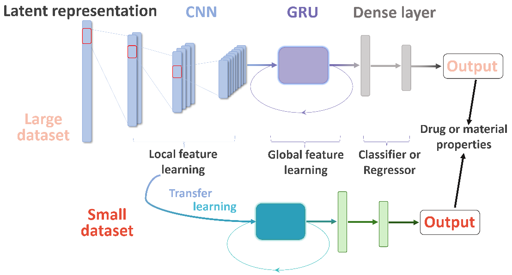

# CRNNTL

Implementation of the Paper "CRNNTL: convolutional recurrent neural network and transfer learning for QSAR modelling in organic drug and material discovery" by Yaqin Li, Yongjin 
Xu, Yi Yu.



## Installing
The input of modelling is the latent representation derived from autoencoders (AEs). Here we will take the CDDD, one of the most widely-used AE, as an example. While other AEs could be used as well for our method. The link of CDDD is show below:

https://github.com/jrwnter/cddd
```
python 3.6
tensorflow 1.14.0
numpy <= 1.16.4
pandas <= 1.2.4
rdkit
scikit-learn
pytorch 1.2.0
skorch 0.10.0
CDDD
```
### Install via Anaconda (recommended way)
Create a conda environment:
```bash
git https://github.com/YiYuDL/CRNNTL.git
cd CRNNTL
conda env create -f environment.yml
source activate CRNNTL
python setup.py install
```

## Getting start
The fibroblast growth factor receptor (fgfr1) will be taken as an instance. Other datasets in our package could be used, as well as datasets from other source.
### Data Preprocessing
Extracting latent representation and classes splitting:
```python
from CRNNTL.preprocessing import data_pre
X_fgfr1, DF_fgfr1 = data_pre('fgfr1') 
```

### CNN and CRNN Modelling
```python
from CRNNTL.train import CNN_CRNN_train
CNN_result,CRNN_result = CNN_CRNN_train(X_fgfr1, DF_fgfr1)
```

### Baseline
```python
from CRNNTL.baseline import SVM
SVM('fgfr1')
```

### Data Augmentation and AugCRNN modelling
```python
from CRNNTL.augmentation import aug
from CRNNTL.aug_train import augCRNN_train
AugX_fgfr1,AugDF_fgfr1 = aug(X_fgfr1, DF_fgfr1)
augCRNN_train(X_fgfr1, DF_fgfr1, AugX_fgfr1,AugDF_fgfr1)
```


### Transfer Learning between Big and Small Datasets
```python
from CRNNTL.TL import TL
TL('fgfr1','aur3')
```

### Performance Comparison of CNN, CRNN and SVM methods based on the Isomer-based Dataset
```python
from CRNNTL.iso import iso_CNN_CRNN_SVM
iso_CNN_CRNN_SVM('isomers')
```

### References
[1] Y. Li, Y. Xu, Y. Yu, CRNNTL: convolutional recurrent neural network and transfer learning for QSAR modelling in organic drug and material discovery, 2021, Preprint: https://arxiv.org/abs/2109.03309

[2] R. Winter, F. Montanari, F. Noe and D. Clevert, Learning Continuous and Data-Driven Molecular Descriptors by Translating Equivalent Chemical Representations Chem. Sci, 2019, 10, 1692-1701.
